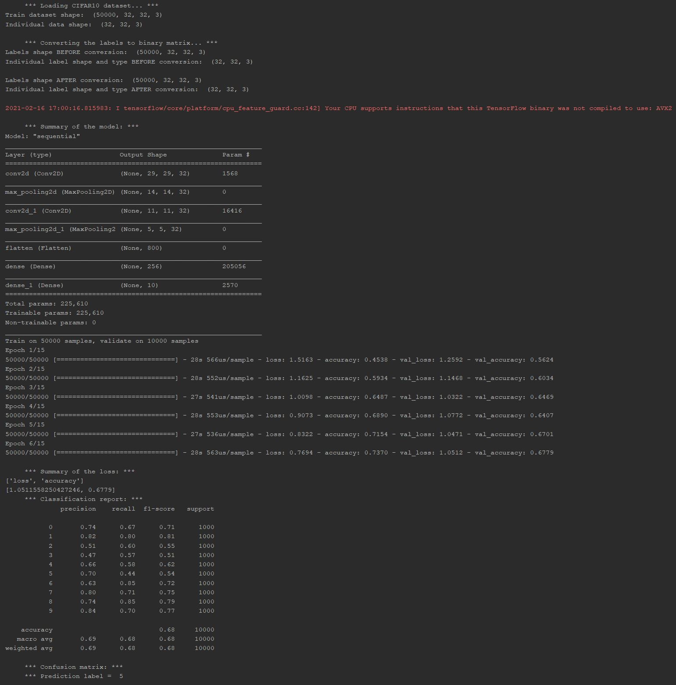

In this task, you are required to design a simple CNN model to train and predict on CIFAR images.
To begin, clone this repo into your local machine.
You will need to install the dependencies as stated in the requirements.txt:

    pip install -r requirements.txt

The `main.py` includes the skeleton of the code. All method headings are already pre-written and some of them are complete.
The methods that you need to complete for this task are `convert_labels`, `build_model`, and `train_model`. Upon successful
completion of these methods, run the code. Please note that at the bottom of the file all the necessary steps are there to run the code.

If successful, your terminal log should return something like this:

Additionally, the code should output 4 different plots which you should save them for evaluation of the task.